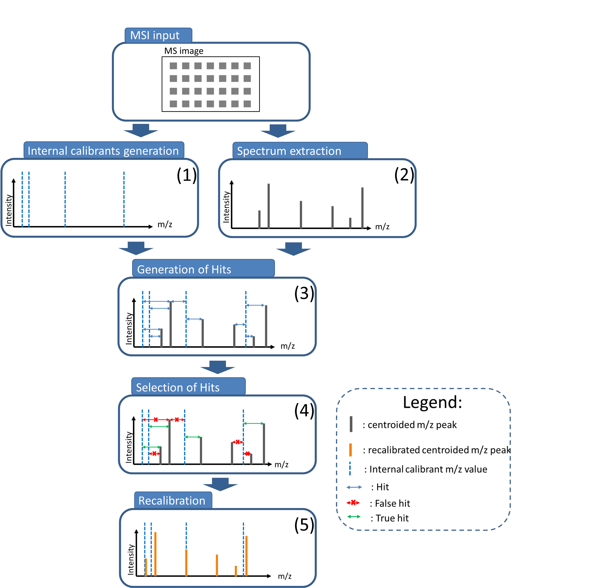

# Using Biological Signals for Mass Recalibration of Mass Spectrometry Imaging Data

This repository contains the python script performing the recalibration of mass spectrometry images (MSI) from the associated paper [Using Biological Signals for Mass Recalibration of Mass Spectrometry Imaging Data](https://chemrxiv.org/articles/preprint/Using_Biological_Signals_for_Mass_Recalibration_of_Mass_Spectrometry_Imaging_Data/12901679).


The selection of internal calibrating signals for a global MSI acquisition is not trivial, prone to false positive detection of calibrating signals and therefore to poor recalibration. To fill this gap, this work describes an algorithm that recalibrates each spectrum individually by estimating its mass shift with the help of a list of internal calibrating ions. The method exploits RANSAC (*Random Sample Consensus*) algorithm, to select, in a robust manner, the experimental signal corresponding to internal calibrating signals by filtering out calibration points with infrequent mass errors and by using the remaining points to estimate a linear model of the mass shifts.

<p align="center"></p>

The method developed in the paper is divided into 5 steps. (1) The generation of a list of internal calibrating ions for the whole MSI data according to similar public MSI datasets from METASPACE (i.e., representing the same kind of biological samples) since we assume them to share metabolites with the sample of interest. (2) Centroid MS spectra are extracted from each pixel. (3) The calibrant hits are generated by computing the mass errors between the list of potential internal calibrating ions and the spectrum signals for each pixel. (4) The preferential calibrant hits are selected as those with the most frequent mass errors with the aim to select true hits. (5) A linear model for predicting the mass shifts based on the preferential hits is then constructed and applied to all spectra for their recalibration.

This repository contains the scripts performing all the steps of the method developed in the paper. The code to generate the evaluation plots will be added in the future.

## Generation of a list of internal calibrating ions: how to run the code? 

### Prerequisites 

The code is written in <code>python 3</code> and runs with the following libraries: 

```
numpy==1.18.1
pandas==1.0.1
metaspace==1.8.1
```

### Jupyter notebook example

The code in the <code>recalibration</code> folder under the name <code>internal_calibrants_generation.ipynb</code> is a notebook containing the functions and an example of how to generate the internal calibrating ions from different METASPACE metadata.


## Recalibration: how to run the code? 

### Prerequisites 

The code is written in <code>python 3</code> and runs with the following libraries: 

```
numpy==1.18.1
scipy==1.4.1
pyimzml==1.2.6
scikit-learn==0.22.1
```

### Command line

The code performing the recalibration is located in the <code>recalibration</code> folder under the name <code>recalibration.py</code>.

```
python recalibration.py -i /path/to/the/imzML/file.imzML -i2 /path/to/the/list/of/masses/file.txt -o /path/to/the/output/imzML/file.imzML -st 0.0005 -tl 0.01 -lm 0.002
```
Note that you will need to replace */path/to/the/imzML/file.imzML* and */path/to/the/output/imzML/file.imzML* by the path of the corresponding imzML file subjects to recalibration and the name of the output imzML file respectively. Also, you will need to replace */path/to/the/list/of/masses/file.txt* by the path of the actual location of the <code>.txt</code> file containing the values of the masses of the potential internal calibrant ions. 
The <code>.imzML</code> file and its corresponding <code>.ibd</code> file should be located in the same folder. The spectra should be centroided. 

### Arguments

The values of the following arguments <code>-st</code>, <code>-tl</code> and <code>-lm</code> are already set for MSI acquired with high precision mass analyzers such as FT-ICR and Orbitrap. The <code>-st</code> argument allows to modify the bandwidth of the density estimation of the errors. The <code>-tl</code> argument allows to modify the tolerance in Dalton for the hits generation. It should be large enough to take into consideration all the possible mass shifts occurring in the MSI. Finally, the <code>-lm</code> argument is the tolerance window in Dalton around the most frequent mass error.

For lower precision mass analyzers, all those parameters should be increased, 
for example MSI acquired with a rapifleX we suggest that the user introduce the following settings <code>-st 0.03</code>, 
<code>-tl 0.8</code> and <code>-lm 0.08</code>. 

Care should be taken for lower-resolution instruments as they were not the subject of this paper. 
However, to give an idea of the possible range of values for the arguments, we suggest that the user introduce the following settings <code>-st 0.03</code>, 
<code>-tl 0.8</code> and <code>-lm 0.08</code> for rapifleX data which can be considered as the upper limit of the algorithm.


## How to cite us?
Please cite our publication by using the following bibtex entry:

```bibtex
@article{La Rocca2020,
author = "Raphaël La Rocca and Christopher Kune and Mathieu Tiquet and Lachlan Stuart and Theodore Alexandrov and Edwin De Pauw and Loïc Quinton",
title = "{Using Biological Signals for Mass Recalibration of Mass Spectrometry Imaging Data}",
year = "2020",
month = "9",
url = "https://chemrxiv.org/articles/preprint/Using_Biological_Signals_for_Mass_Recalibration_of_Mass_Spectrometry_Imaging_Data/12901679",
doi = "10.26434/chemrxiv.12901679.v1"
}
```

## License

Apache v2.0
See the [LICENSE](LICENSE) file for details.
